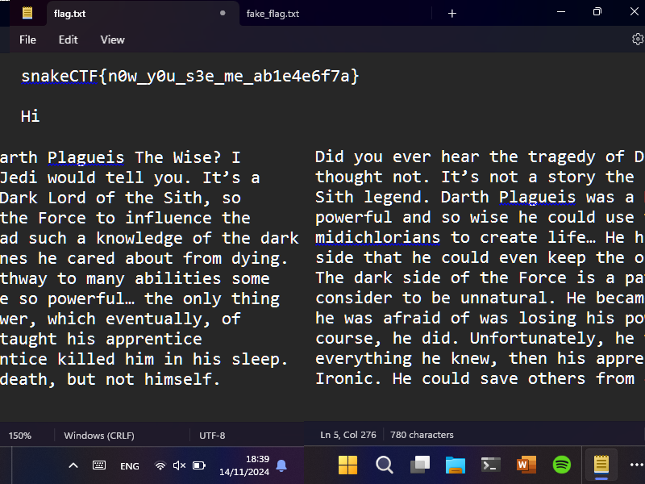

# data-interception [_snakeCTF 2024 Finals_]

**Category**: network

## Description

When we are in the IT Lab, our professor is able to see what we are doing on our computers.
We managed to capture some packets from the network, can you help us find out how?

## Solution

### Traffic Analysis

The provided file is a pcap file. Wireshark can be used to analyze the traffic.
By opening the Protocol Hierarchy Statistics, it can be seen that the traffic is mostly TCP packets, particularly VNC packets, which account for more than 70% of the traffic bytes.

### Analysis of the VNC Packets

By utilizing the display filter `vnc`, it can be seen that there are almost no packets from the server to the client. This is because Wireshark is unable to decode certain packets.
So, by broadening the filter to `tcp.port == 5900`, all the VNC traffic can be seen. Since Wireshark is unable to provide information about these packets, it is necessary to refer to the documentation of the VNC protocol.

The [RFB protocol](https://github.com/rfbproto/rfbproto), commonly known as VNC, is a simple protocol for remote access to graphical user interfaces.

Since the protocol's main purpose is to share graphical data, the flag can be assumed to be inside the stream of frames.

Because the protocol allows multiple frame encoding types, it is necessary to know the encoding type used to parse them.
Fortunately, the [FramebufferUpdate](https://github.com/rfbproto/rfbproto/blob/master/rfbproto.rst#id80), which contains the frame data, also contains the encoding type used for the packet.
But Wireshark is unable to decode the _FramebufferUpdate_ packets because they are too large and fragmented. So, it is necessary to extract the data from the packets sent by the server and parse it.

By examining the documentation and the beginning of the fragmented packets, it is possible to see that the _FramebufferUpdate_ packets start with the byte `00000001` because they contain only one rectangle.
Therefore, it is possible to copy all the data from the server, search for the start of the _FramebufferUpdate_ packets, and then use that to parse the rest of the structure.

After analyzing the data, it is apparent that the encoding type used is `Raw`, so we just need to extract the actual frame data from the packets and save it to a file. 
But before doing so, we also need to know the dimensions of the frame and the number of bytes per pixel. 
This width and height can be found in the same _FramebufferUpdate_ packet that contains the encoding type, while the number of bytes per pixel can be found in the [SetPixelFormat](https://github.com/rfbproto/rfbproto/blob/master/rfbproto.rst#id61) packet.

After encoding the file to PNG, the result is:

### Automating the Process

To automate the process, this [script](solve.py) can be used.
