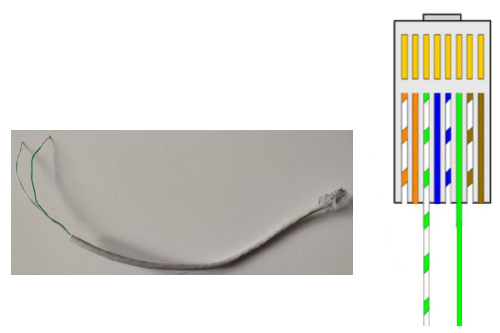
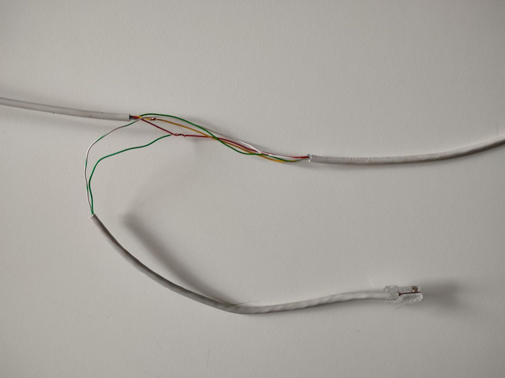
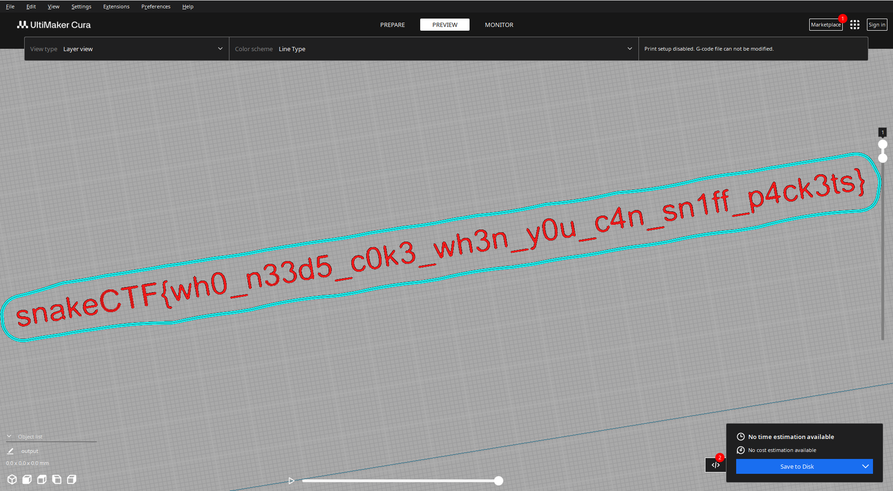

# Go ahead take a sniff [_snakeCTF 2024 Finals_]

**Category**: network

## Description
In this challenge, you must tap into an Ethernet wire to intercept the traffic between an OctoPrint server and a client using the OctoPrint API. By capturing the data flow, you'll analyse the exchanged packets to uncover the flag. The traffic includes API requests and responses related to printer settings and commands.

### Hints
- We offer higher security standard through the use of slithering copper cables

## Solution
### Creating The tools
As shown in the image, two tapping tools must be created using a piece of Ethernet cable. The only two wires needed on the cable are the green wires, which, in 100BASE-T and 10BASE-T networks, correspond to the RX pins of the network interface card.


### Tapping into the network
Using the tools created earlier, the ethernet cable can be tapped without breaking any wires or interrupting the connection, as shown.


### Capturing the Traffic
The Ethernet interface must be utilised to sniff and capture the traffic on the cable. If the packets contain only the response from the server, it can be concluded that the wrong pair of wires in the cable has been connected.

### Understanding the capture
From the packets received from the client, an API request to [`/api/version`](https://docs.octoprint.org/en/master/api/version.html#version-information) is observed, and the server is seen to respond with:
```JSON
{
    "api":"0.1",
    "server":"1.10.3",
    "text":"OctoPrint 1.10.3"
}
```
It can now be concluded that the server is an OctoPrint server for a 3D printer.
The capture is divided into the following parts:
- Packets containing information about the printer's status are observed, such as `GET` requests to [`/api/job`](https://docs.octoprint.org/en/master/api/job#get--api-job) and [`/api/printer`](https://docs.octoprint.org/en/master/api/printer#get--api-printer)
- Packets containing GCode commands on the path [`/api/printer/command`](https://docs.octoprint.org/en/master/api/printer#post--api-printer-command) command are observed, which essentially do nothing but serve to describe certain print information, such as the maximum X or Y coordinates reached, the print time, and print thumbnails
- Once the bed temperature is set with the command [`M140 S60`](https://marlinfw.org/docs/gcode/M140.html) and the hot-end temperature with the command [`M104 S220`](https://marlinfw.org/docs/gcode/M104.html), the system waits for the target temperature to be reached
- After some setup and [`homing`](https://marlinfw.org/docs/gcode/G028.html), the printer begins the actual printing process, as can be seen from the [`G0`](https://marlinfw.org/docs/gcode/G000-G001.html) and [`G1`](https://marlinfw.org/docs/gcode/G000-G001.html) commands
- Once the print is complete, the API client turns off the hot-end and the bed

### Extracting the flag
The capture is read and filtered, retaining the packets that contain the GCode commands in JSON format, which are then saved in the file [`output.gcode`](./output.gcode).
```Python
from scapy.all import *
import json

input_file = 'capture.pcapng'

def is_http_packet(packet):
    if packet.haslayer(TCP) and packet.haslayer(Raw):
        payload = packet[Raw].load.decode(errors='ignore')
        if payload.startswith(("{\"command\"")):
            return True
    return False

cap = rdpcap(input_file).filter(is_http_packet)
gcode = []
for packet in cap:
    gcode.append(json.loads(packet[Raw].load.decode('utf-8'))["command"])
with open("output.gcode", "a") as p:
    p.write("\n".join(gcode))

```
Once the GCode file is extracted, it can be opened with a slicer or a GCode viewer to reveal the hidden flag:


