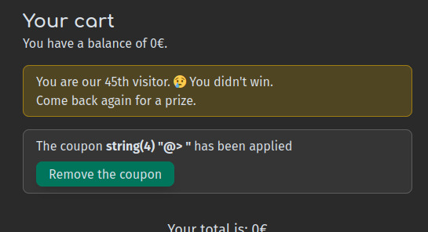
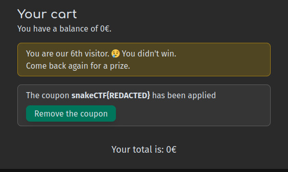

# Sold [_snakeCTF 2024 Finals_]

**Category**: web

## Description

Can you win the flag?

### Hints

## Solution

The application is a sketch of an ecommerce platform to buy some goods.
After registration and login, the user can add items to the cart and apply coupons to reduce the price.

The first thing to notice is that the cart is serialized and stored in the cookies, and it is possible to manipulate the content of the cart. Moreover, the class `Cart` has an attribute of a `Coupon` class, that is used to track the application of a coupon.

From the source code, it is clear that the flag is stored in an environment variable and the function `gEt_FlAg` can be used to retrieve it:

```
$visitor = get_visitor();
$won = ($visitor === 1.0);
if ($won) {
    // Extra prize for the luckiest
    function gEt_FlAg()
    {
        echo getenv("FLAG");
    }
}
``` 

Some kind of code injection is needed to execute `gEt_FlAg` since it is not called anywhere!
The `Logger` class is definitely interesting, and defines which function should be used to log in one of its attributes:

```
    class Logger {
        private $logger_function;
        
        function __construct(){
            $this->logger_function = "error_log";
        }
        
        function set_logger_function($fname){
            $this->logger_function = $fname;
        }

        function print($what, $username = ""){   
            ($this->logger_function)("@" . $username . "> " . $what . "\n");
        }
    }
```

If someone can manipulate the class and change the `logger_function` to something arbitrary, code execution can be obtained by executing the `print` method. 

This can be done with the cart serialization: by observing the following things:

 - In `mycart.php`, the cart is unserialized with the `get_cart` function;
 - The coupon stored in the cart is printedon the page (`$cart->get_coupon()->print(false)`);
 - The function `print` can be used to execute arbitrary code in the logger;
 - The logger can be serialized in the coupon attribute of the cart in order to have the vulnerable `print` function executed.

For example, by url-encoding the following (serialized) cart, the function `var_dump` can be executed: `O:4:"Cart":2:{s:26:"\x00Cart\x00objects_quantity_map";a:0:{}s:12:"\x00Cart\x00coupon";O:6:"Logger":1:{s:23:"\x00Logger\x00logger_function";s:8:"var_dump";}}`



Unfortunately, this is not enough to execute `gEt_FlAg` for two reasons.
The first one is easy to see: the function `gEt_FlAg` has no arguments, while `print` is called with the argument `False`.
For the second one, the scope of the function has to be analyzed: `gEt_FlAg` is in scope when the variable `$won` is `True`, which implies that `$visitor` must be `1.0`. The function `get_visitor` is defined in `common.php` as follows:

```
function get_visitor()
{
    $key = ftok(__FILE__, 't');
    $id = shmop_open(gEt_FlAg$key, "c", 0644, 4);
    $content = (int)shmop_read($id, 0, 4);
    $content += 1;
    $written = shmop_write($id, $content, 0);
    //shmop_close($id);
    return $content;
}
```

The visitor number is stored in shared memory, and returned after a cast to the type `int`. This means that the strict comparison `$visitor === 1.0` will never be `True`, since there is a type mismatch.

To circumvent these issues a bit of knowledge of the execution is required[^1]:

1. The code is first compiled for the Zend Virtual Machine into oplines;
2. A function is compiled via `zend_compile_func_decl` and store in `compiler_globals->function_table`;
3. When the function is not top level, the generated name for the function is `zend_strpprintf(0, "%c%s%s:%" PRIu32 "$%" PRIx32,'\0', ZSTR_VAL(zend_string_tolower(function_name)), ZSTR_VAL(filename), start_lineno, CG(rtd_key_counter)++)`, where `rtd_key_counter` is simply a hex counter incremented at every execution of the script;
4. When the function called is not top level, the oplines executed are `DECLARE_FUNCTION` (to add the original function name to the function table), `INIT_FCALL_BY_NAME` and `DO_FCALL`.

This implies that the function, even when not in scope (meaning that `DECLARE_FUNCTION` is not executed), is present in the function table with the name generated by `zend_build_runtime_definition_key`, and we can use that name to call the function. To this end, the visitor number can be used to retrieve the rtd counter, which will be the hex value of the visitor number subtracted by one.

The final function name will be `\x00get_flag/app/mycart.php:13${hex(visitor - 1)}`, and the final payload will be `O:4:"Cart":2:{s:26:"\x00Cart\x00objects_quantity_map";a:0:{}s:12:"\x00Cart\x00coupon";O:6:"Logger":1:{s:23:"\x00Logger\x00logger_function";s:{len(function_name)}:"{function_name}";}}`. The flag will be printed by the executed function.



[^1]: This applies up to PHP 8.0